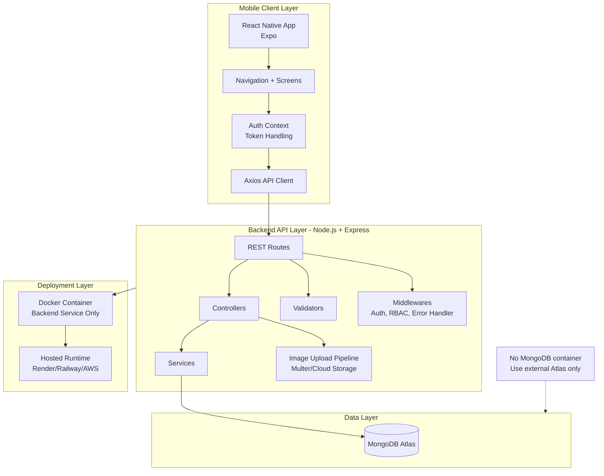
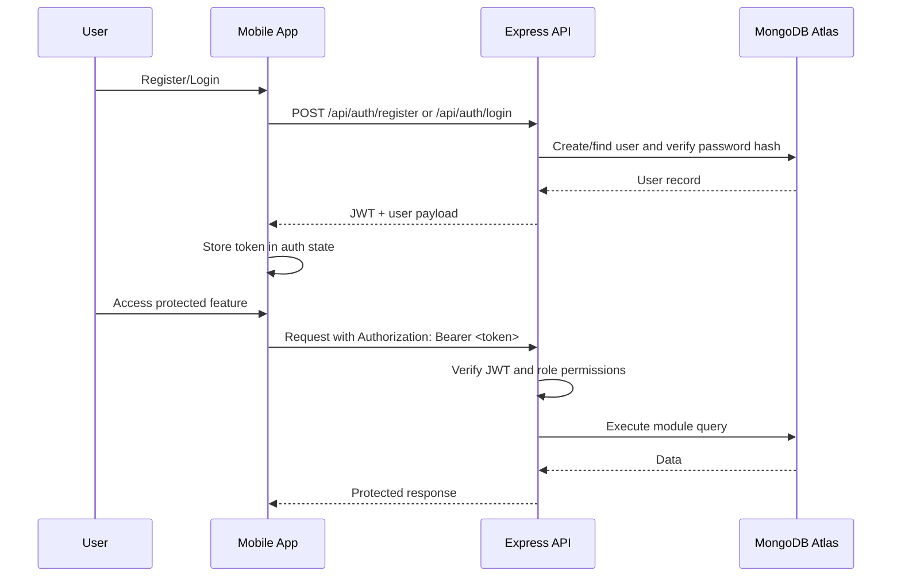

# Estava System Architecture

This document is the assignment architecture deliverable for the Estava real estate mobile application.

## High-Level Architecture Diagram

## Request Flow

1. User performs an action from the React Native app.
2. App sends HTTP request to hosted Express API using Axios.
3. Express routes apply validation and authentication middleware.
4. Controller delegates business logic to service layer.
5. Service layer reads/writes MongoDB Atlas using Mongoose models.
6. API returns standardized success/error response to mobile app.

## Authentication and Authorization Flow

## Assignment Compliance Mapping

- Mobile frontend: React Native
- Backend API: Node.js + Express.js
- Database: MongoDB Atlas
- Authentication: registration, login, hashing, JWT, protected routes
- Backend hosted online for final demo
- Mobile app connected to hosted API
- Docker usage: backend containerized only
- MongoDB excluded from Docker and connected externally

## Module Placement in Architecture

- Common module: Authentication
- Member modules:
  - Property Management
  - Favorites / Wishlist
  - Inquiry / Contact
  - Appointment / Visit Booking
  - Reviews & Ratings
  - Notification

All modules follow the same backend layering pattern: routes -> controllers -> services -> models with shared middleware and validators.

## Non-Functional Standards

- RESTful API design
- Centralized error handling
- Secure middleware (helmet, cors, rate limiting)
- Environment-based secrets and configuration
- Role-aware authorization checks for Buyer/Renter, Agent/Seller, Admin
